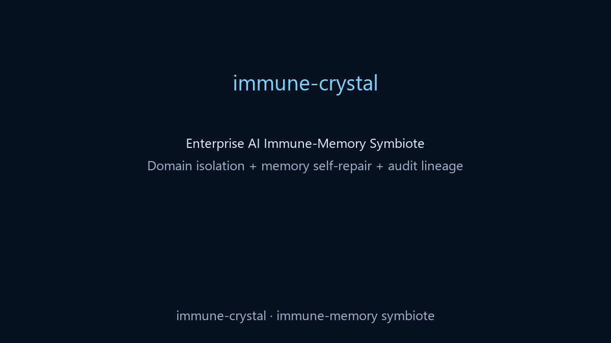

# immune-crystal

[](https://www.python.org/)
[](https://fastapi.tiangolo.com/)
[](./LICENSE)
[](#roadmap)
[](#enterprise-use-cases)

English | [简体中文](./README.zh-CN.md)

General-purpose Enterprise AI Immune-Memory Symbiote: a defensive memory layer that combines dynamic domain isolation with periodic time-crystal self-repair.

> Build enterprise AI that is safe, stateful, and auditable.

## One-Minute Demo



## What You Get

- Domain-agnostic isolation (`customer_support`, `engineering`, `hr`, `finance`, etc.)
- Cross-domain leakage and prompt-injection interception
- Periodic memory reinforcement and noise decay
- Full audit signals on each response: `purity`, `lineage`, `audit_id`

## Comparison (vs RAG / Guardrails)

| Capability | Vanilla RAG | Guardrails-only | immune-crystal |
| --- | --- | --- | --- |
| Cross-domain isolation | Partial | Partial | Strong |
| Prompt injection resistance | Weak | Strong | Strong |
| Long-session memory self-repair | Weak | None | Strong |
| Conflict-state handling | Weak | Rule-based | Dynamic quarantine phase |
| Output traceability | Medium | Medium | Strong (`purity` + `lineage`) |

## Quick Start

```bash
pip install -e .
uvicorn api.app:app --host 0.0.0.0 --port 8000
```

```bash
cd web
npm install
npm run dev
```

## API

- `POST /inject`
- `POST /bootstrap`
- `POST /chat`
- `POST /poison/test`
- `GET /domains`
- `GET /crystal/state`
- `GET /audit`
- `GET /audit/{id}`
- `POST /crystal/reset/{cell_id}`

## Demos

```bash
python examples/generic/bootstrap_and_chat.py
python examples/finance/loan_conflict.py
python examples/medical/cross_domain_poison.py
```

## Benchmarks

```bash
python benchmarks/pollution_intercept.py
python benchmarks/memory_repair.py
python benchmarks/audit_latency.py
```

## Enterprise Use Cases

- Internal copilot safety gateway
- RAG access guard across team boundaries
- Agent memory governor for long-running workflows
- Compliance evidence layer in regulated environments

## Roadmap

- [ ] Domain profile import/export
- [ ] Policy DSL for enterprise guardrails
- [ ] Streaming API and async workers
- [ ] Multi-tenant dashboard
- [ ] Larger benchmark datasets
